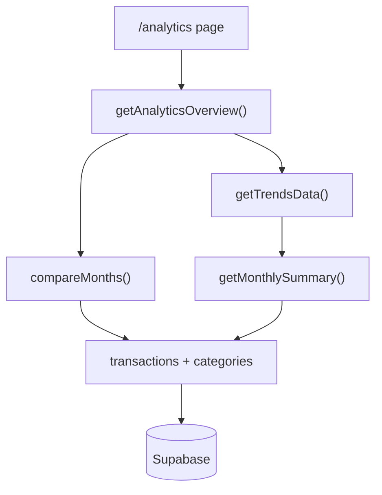

# Moduł analityki Budgetly

## Cel modułu

Moduł `/analytics` odpowiada na pytania użytkownika o długoterminowe zachowanie finansów:

- Czy przychody i wydatki rosną czy maleją w czasie?
- Jaki jest wskaźnik oszczędności w kolejnych miesiącach?
- Które kategorie wydatków zmieniły się najbardziej między bieżącym a poprzednim miesiącem?

Strona `/trends` przekierowuje do `/analytics` (zachowanie kompatybilności zakładek).

## Metryki

### Wskaźnik oszczędności (savings rate)

```
savingsRate = round(((income - expenses) / income) * 100)
```

- Gdy `income <= 0`, wskaźnik jest `null` (brak sensownego mianownika).
- Implementacja: `calculateSavingsRate()` w `services/analytics.service.ts`.

### Zmiana kategorii (%)

```
changePercent = round(((current - previous) / previous) * 100)
```

- Gdy `previous === 0` i `current > 0`, zwracane jest `null`.
- Gdy oba są zerem, zwracane jest `0`.
- Implementacja: `calculateChangePercent()` w `services/analytics.service.ts`.

### Największe zmiany kategorii

Porównywane są **wyłącznie wydatki** (`type = expense`) w bieżącym i poprzednim miesiącu kalendarzowym. Wybierane są 5 kategorii z największą wartością bezwzględną różnicy kwot.

## Architektura



Warstwy:

1. **UI** — `app/(dashboard)/analytics/page.tsx`, komponenty w `components/analytics/`, wykres `TrendsLineChart`.
2. **Serwis analityki** — `services/analytics.service.ts` (metryki, agregacja).
3. **Serwisy domenowe** — `services/trends.service.ts`, `services/compare.service.ts`, `services/transaction.service.ts`.
4. **Baza** — tabele `transactions`, `categories` (patrz [database-diagram.md](./database-diagram.md)).

## Trade-offs

| Decyzja | Uzasadnienie |
|---------|-------------|
| 12 wywołań `getMonthlySummary` zamiast jednego SQL | Prostsza implementacja, spójność z istniejącym API; wystarczająca dla osobistego budżetu |
| Movers tylko dla wydatków | Porównanie miesięcy w aplikacji historycznie dotyczyło wydatków; przychody są widoczne w trendach |
| Waluta wyświetlania z profilu | Kwoty sumowane w PLN (model bazowy); konwersja wyświetlania nie zmienia historycznych stawek |
| `/trends` → redirect | Uniknięcie duplikacji tras; jeden punkt wejścia do analityki |

## Rozszerzenia

- **Plan 008 (multi-currency)** — agregacje powinny używać `amount_base`; dokumentacja i wykresy wymagają aktualizacji.
- Import wyciągów bankowych (osobny format CSV).
- Materialized view / cache miesięczny przy wzroście liczby użytkowników.

## Powiązanie z ER

Moduł korzysta z:

- `transactions` — kwoty, daty, typ (`expense` / `income`), `category_id`
- `categories` — nazwa, kolor, ikona do tabeli movers

Szczegóły relacji: [database-diagram.md](./database-diagram.md).
