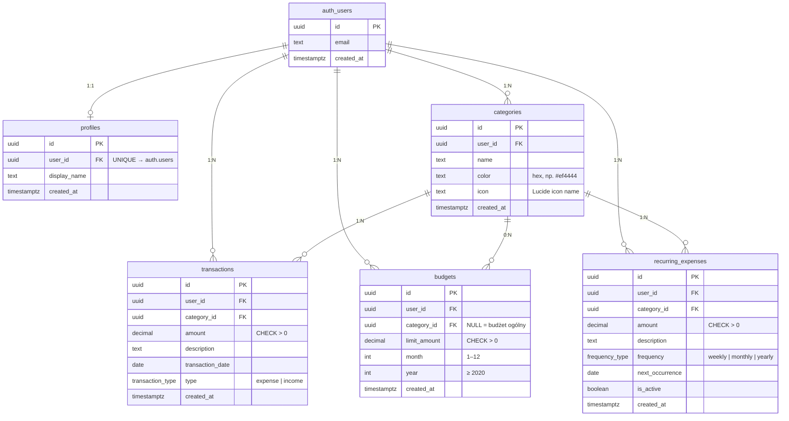

# Diagram bazy danych — Budgetly

Diagram encji i relacji dla schematu PostgreSQL w Supabase.

## Diagram ER (Mermaid)



## Relacje tekstowe

```
auth.users (Supabase Auth)
    │
    ├── profiles (1:1)
    ├── categories (1:N)
    ├── transactions (1:N)
    ├── budgets (1:N)
    └── recurring_expenses (1:N)

categories ──< transactions
categories ──< budgets (nullable FK = budżet ogólny)
categories ──< recurring_expenses
```

## Indeksy

| Tabela | Indeks |
|--------|--------|
| `categories` | `(user_id)` |
| `transactions` | `(user_id)`, `(user_id, transaction_date)`, `(category_id)` |
| `budgets` | `(user_id, month, year)` — UNIQUE `(user_id, category_id, month, year)` |
| `recurring_expenses` | `(user_id, is_active)` |

## Row Level Security (RLS)

Każda tabela publiczna ma włączone RLS z politykami:

- **SELECT** — `auth.uid() = user_id`
- **INSERT** — `auth.uid() = user_id`
- **UPDATE** — `auth.uid() = user_id`
- **DELETE** — `auth.uid() = user_id`

Migracje: `supabase/migrations/002_rls_policies.sql`

## Normalizacja (2NF)

- Każda tabela ma klucz główny (`uuid`).
- Brak złożonych kluczy z częściowymi zależnościami.
- Atrybuty kategorii nie są duplikowane w transakcjach (FK zamiast embed).
- Limity budżetów są w osobnej tabeli `budgets`, nie w `transactions`.

## Zrzut ekranu ze Supabase

Po wdrożeniu migracji możesz wykonać zrzut ekranu schematu:

1. Supabase Dashboard → **Table Editor**
2. Lub **Database → Schema Visualizer** (jeśli dostępny w projekcie)

Dołącz zrzut do prezentacji / dokumentacji zaliczeniowej obok diagramu Mermaid powyżej.

## Typy enum

```sql
CREATE TYPE transaction_type AS ENUM ('expense', 'income');
CREATE TYPE frequency_type AS ENUM ('weekly', 'monthly', 'yearly');
```

Pełny DDL: `supabase/migrations/001_initial_schema.sql`
